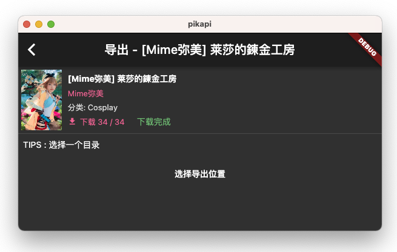
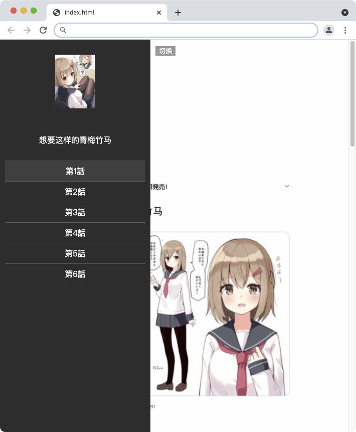

PIKAPIKA - 漫画客户端
===================

- 美观易用且无广告的漫画客户端, 能运行在Windows/MacOS/Linux/Android/IOS中。
- 此APP内容存在限制级别内容(例如 露骨/血腥/暴力/吸毒)，18岁以下的用户需在监护人陪同下使用，并请您在遵守当地法律法规。
- 您的star和issue是对开发者的莫大鼓励, 可以源仓库下载最新的源码/安装包, 表示支持/提出建议。
- 源仓库地址 [https://github.com/niuhuan/pikapika](https://github.com/niuhuan/pikapika)

## 界面 / 功能

### 分流

VPN->代理->分流, 这三个功能如果同时设置, 您会在您手机的VPN上访问代理, 使用代理请求分流服务器。

### 漫画分类/搜索

 

### 漫画阅读/下载/导入/导出

您可以导出任意已经完成的下载到zip, 从另外一台设备导入。 导出的zip解压后可以直接使用其中的HTML进行阅读

### 游戏

## 特性

- [x] 用户
    - [x] 登录 / 注册 / 获取个人信息 / 自动打卡
    - [x] 修改密码 / 修改签名 / 修改头像
- [x] 漫画
    - [x] 分类 / 搜索 / 随机本子 / 看此本子的也在看 / 排行榜
    - [x] 在分类中搜索 / 按 "分类 / 标签 / 创建人 / 汉化组" 检索
    - [x] 漫画详情 / 章节 / 看图 / 将图片保存到相册
    - [x] 收藏 / 喜欢
    - [x] 获取评论 / 评论 / 评论回复 (社区评论后无法删除, 请谨慎使用)
    - [x] 更新提示
- [x] 游戏
    - [x] 列表 / 详情 / 无广告下载
- [x] 下载
    - [x] 导入导出 / 无线共享 / 移动设备与PC设备传输
    - [x] 导出到加密的归档文件 / 直接观看加密的归档文件
- [ ] 聊天室
- [x] 缓存 / 自动清理
- [x] 设备支持
    - [x] 移动端
      - [x] 文件关联
      - [x] 自定义超链接
    - [x] 安卓
        - [x] 高刷新频率屏幕适配 (90/120/144... Hz)
        - [x] 安卓10以上随系统进入深色/夜间模式

## 其他说明

数据资料存储位置

- ios/android : 程序自身数据目录中, 删除就会清理
- windows : 程序同一目录中data文件夹下
- macos : ~/Library/Application\ Support/pikapika
- linux : ~/.pikapika

## 技术架构

### 多平台适配

这个应用程序使用golang和dart(flutter)作为主要语言, 可以兼容Windows, linux, MacOS, Android, IOS

使用了不同的框架桥接到桌面和移动平台上

- go-flutter => Windows / MacOS / Linux
- gomobile => Android / IOS

### 构建环境

(桌面端/移动端)

- [golang](https://golang.org/) (1.17/1.18)
- [flutter](https://flutter.dev/) (2.10.3/3.0.4)

## 请您遵守使用规则

软件副本分发以及代码使用规则

- 本软件的代码在未经允许的情况下可以自用但不允许释放任何releases, 个人或企业不可用于商业用途, 不可上架任何商店。
- 不要在任何其他 **二次元软件** 的 **聊天社区** 或 **开发社区** 内, 发布有关本软件的链接或信息, 对于观点不同产生的分歧作者不站队任何立场。
- 不要发送本软件安装包到 **任何社区内** , 不要将APK/IPA/ZIP/DMG发送包括任何聊天软件内的群聊功能。 请使用Github中提供的Releases页面的链接。
- 对本仓库的fork需要保留本仓库的链接, 以引导用户在主要仓库进行讨论。

责任声明

- 作者仅分享编程技术, 不分发软件, 不对分发软件承担任何后果。 因传播载造成的法律问题或纠纷, 需行为人自行承担, 请您遵守当地法以及副本接受方(社区或人)所在地区的法律。
