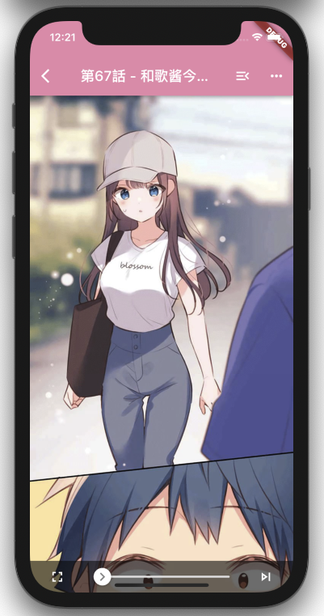
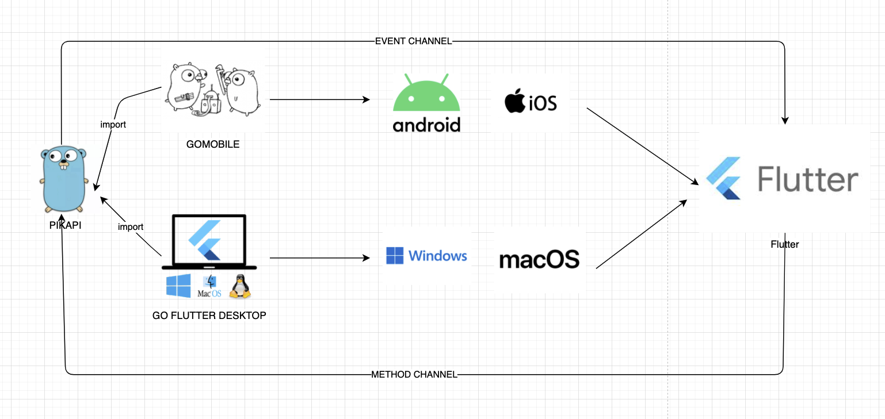

PIKAPIKA - Comic Reader
=======================

- A visually appealing, easy-to-use, ad-free manga client that runs on Windows/MacOS/Linux/Android/iOS.
- This app contains restricted content (such as explicit, gory, violent, drug-related scenes). Users under 18 should use it under parental supervision, and please comply with local laws and regulations.
- Your stars and issues are a great encouragement to the developers. You can download the latest source code/installation package from the source repository to show support/offer suggestions.
- Source Repository URL is [https://github.com/niuhuan/pikapika](https://github.com/niuhuan/pikapika)

## Interface / Functions

### Traffic Diversion

VPN -> Proxy -> Traffic Diversion: If these three functions are set simultaneously, you will access the proxy through the VPN on your phone, using the proxy to request the traffic diversion server.

### Comic categories/search

Search comics in categories

### Comic reader/download/imports/exports

You can export any completed downloads to a zip file and import it from another device. After extracting the exported zip, you can directly use the HTML files within for reading.

### Games

You can download games without ads.

## Features

- [x] Users
    - [x] Login / Register / Get personal information / Auto check-in
    - [x] Change password / Signature / Avatar
- [x] Comics
    - [x] Categories / Search / Random comic / Also reading this comic / Rankings
    - [x] Search in categories / Search by "category / tag / creator / translation group"
    - [x] Comic details / Chapters / View images / Save images to the album
    - [x] Favorites / Likes
    - [x] Get comments / Comment / Comment reply (comments in the community cannot be deleted, please use with caution)
    - [x] Update notification
- [x] Games
    - [x] List / Details / Ad-free download
- [x] Downloads
    - [x] Import/export / Wireless sharing / Transfer between mobile and PC devices
    - [x] Export to encrypted archive file / Directly view encrypted archive file
- [ ] Chat room
- [x] Cache / Auto clean
- [x] Device support
    - [x] Mobile
        - [x] File association
        - [x] Custom hyperlinks
    - [x] Android
        - [x] High refresh rate screen adaptation (90/120/144... Hz)
        - [x] Android 10 and above automatically switch to dark/night mode with the system

## Other tips

Data storage location

- ios/android: In the program's own data directory, deleting it will clear it
- windows: In the data folder in the same directory as the program
- macos: ~/Library/Application\ Support/pikapika
- linux: ~/.pikapika

## Technology Stack

### Multi-platform adaptation

This application uses golang and dart (flutter) as the main languages and is compatible with Windows, Linux, MacOS, Android, and iOS.

Different frameworks are used to bridge to desktop and mobile platforms

- go-flutter => Windows / MacOS / Linux
- gomobile => Android / iOS

### Build environment

(Desktop/Mobile)

- [golang](https://golang.org/) (1.17/1.18)
- [flutter](https://flutter.dev/) (2.10.3/3.0.4)

## Please follow the usage rules.

Software copy distribution and code usage rules

- The code of this software can be used for personal use without permission, but no releases are allowed, and it cannot be used for commercial purposes by individuals or companies, nor can it be put on any store.
- Do not post links or information about this software in any **two-dimensional** chat community or development community. The author does not take any stance on any views that differ.
- Do not send the software installation package to **any community**, and do not send APK/IPA/ZIP/DMG to any group chat function in any chat software. Please use the link provided on the Releases page in Github.
- Forks of this repository must retain the link to this repository to guide users to discuss in the main repository.

Disclaimer

- The author only shares programming technology and does not distribute software. The person who spreads the content is responsible for any legal issues or disputes caused by the spread. Please comply with local laws and the laws of the recipient (community or individual) region.
